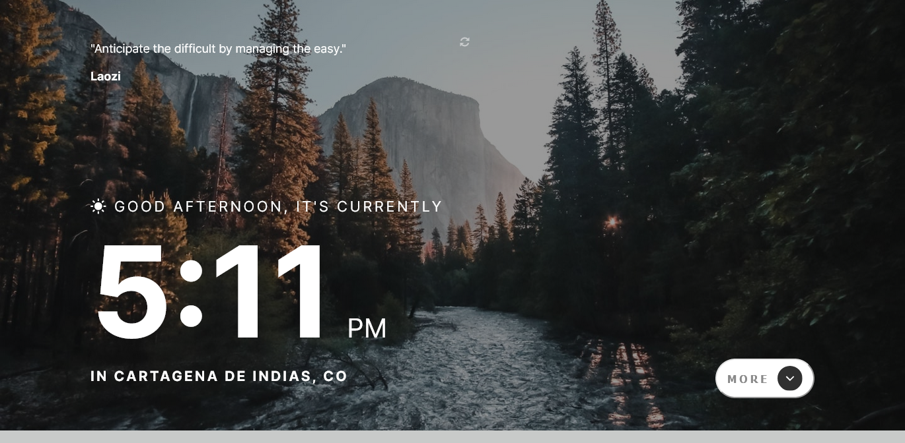

# ClockApp

This is a solution to the [GitHub user search app challenge on Frontend Mentor](https://www.frontendmentor.io/challenges/github-user-search-app-Q09YOgaH6). Frontend Mentor challenges help you improve your coding skills by building realistic projects.

## Table of content

- [Overview](#overview)
  - [The challenge](#the-challenge)
  - [Links](#links)
- [My process](#my-process)
  - [Built with](#built-with)
  - [What I learned](#what-i-learned)
  - [Useful resources](#useful-resources)
- [Author](#author)

## Overview

### The challenge

Users should be able to:

- View the optimal layout for the site depending on their device's screen size
- See hover states for all interactive elements on the page
- View the current time and location information based on their IP address
- View additional information about the date and time in the expanded state
- Be shown the correct greeting and background image based on the time of day they're visiting the site
- Generate random programming quotes by clicking the refresh icon near the quote

### Links

- Solution URL: [See solution](https://github.com/edalguerr/Clock-app)
- Live site URL: [See live](https://edalguerr.github.io/Clock-app/)

## My process

### Built with

- Semantic HTML5 markup
- CSS custom properties
- Flexbox
- CSS Grid
- JS
- BEM Methodoly
- Responsive web design
- Angular

### What I learned

During the development of this project I strengthen my knowledge of html, css, js, BEM methodology, responsive web design and Angular; I used observables, http services, interfaces and communication from son to father with @output.

### Useful resources

- [Quotable](https://api.quotable.io/) - Open source quotations API.
- [freegeoip](https://freegeoip.app/) - Free IP Geolocation API. 
- [WorldTimeAPI](https://worldtimeapi.org/api) - Simple web service which returns the current local time for a given timezone as either plain-text or JSON.

## Author

- Website - [Edwin](https://edalguerr.github.io/)
- Frontend Mentor - [@edalguerr](https://www.frontendmentor.io/profile/edalguerr)
- Twitter - [@edalguerr](https://www.twitter.com/@edalguerr)
